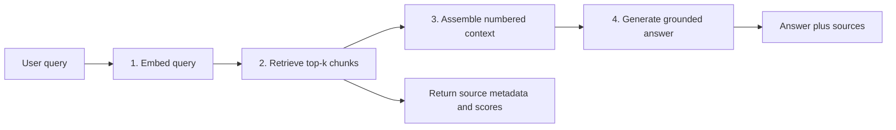

# Query-to-answer RAG flow

The pipeline connects the existing chunk embedding and similarity-search
components to a grounded answer. Indexing embeds each document chunk once;
the query path then runs four small, testable stages.



## Stages

1. **Embed**: `embed_query_stage` converts the query into a vector using the
   same embedding model and vector space used for document chunks.
2. **Retrieve**: `retrieve_stage` compares the query vector with indexed
   vectors using cosine similarity and keeps the top `k` chunks.
3. **Assemble**: `assemble_context` formats the retrieved text as numbered
   passages (`[Source 1]`, `[Source 2]`, ...), preserving the evidence boundary
   used for citations.
4. **Generate**: `generate_answer` sends only the question and assembled
   context to the chat model. The offline demo uses deterministic generation;
   a chat client can be injected for production generation.

The returned `RagResponse` contains the answer and the exact retrieved source
metadata, text, and similarity score. If retrieval returns no sources, the
generation stage returns `I could not find supporting information in the
indexed documents.` instead of guessing.

## End-to-end run

Run the deterministic sample with:

```powershell
python -c "from src.rag_pipeline import run_rag_pipeline; r=run_rag_pipeline(); print(r.answer); [print(s.metadata, s.score) for s in r.sources]"
```

The checked-in output is in [`outputs/rag_pipeline_sample.md`](outputs/rag_pipeline_sample.md).